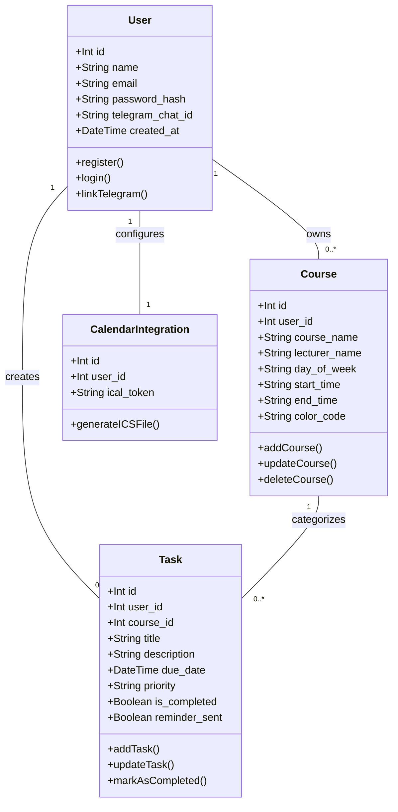
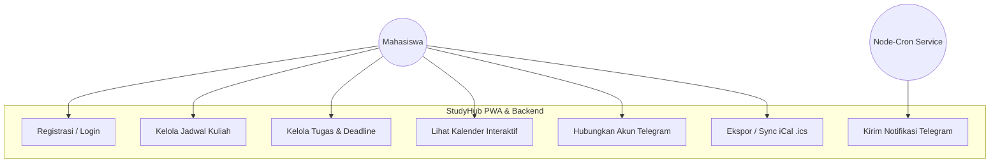
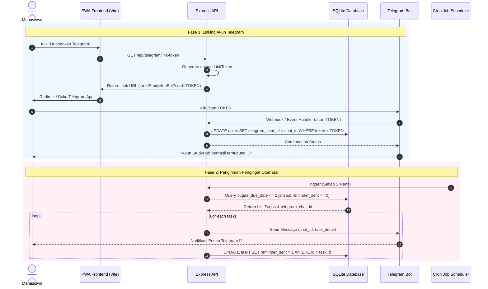
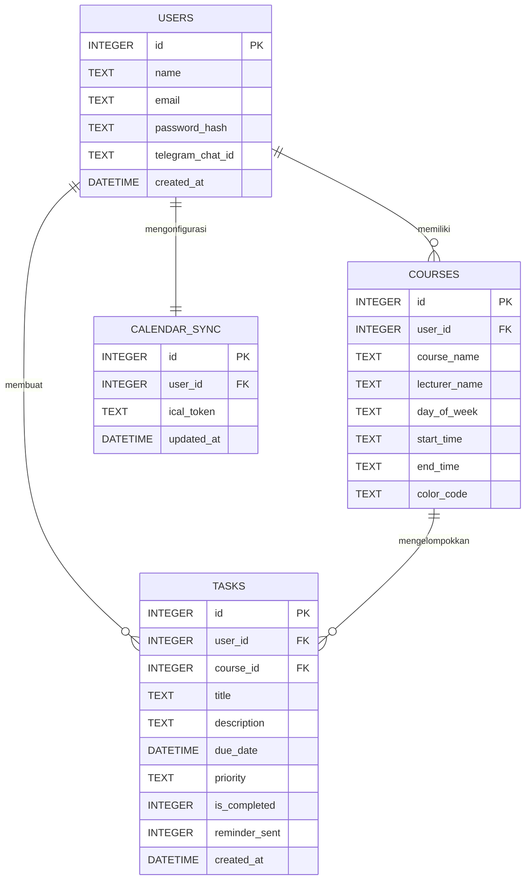

# 📌 Blueprint Teknis Sistem: StudyHub (PWA)

## 1. Arsitektur & Tech Stack

### Front-End (Web & Mobile PWA)

* **Core Framework:** Vite + React (TypeScript)
* **Styling:** Tailwind CSS + Shadcn/ui (UI minimalis & responsif)
* **PWA Engine:** `vite-plugin-pwa` (Service Worker, Web App Manifest, Caching, Installable PWA)
* **State Management & Data Fetching:** `@tanstack/react-query` (Caching, Sync, & Offline support)
* **Routing:** `react-router-dom` v6
* **Icons & Components:** `lucide-react`, `date-fns` (Manipulasi tanggal), `@schedule-x/react` (Tampilan Kalender)

### Back-End (REST API & Scheduler)

* **Runtime & Framework:** Node.js + Express.js (TypeScript)
* **Telegram Integration:** `telegraf` / `node-telegram-bot-api`
* **Cron Engine:** `node-cron` (Pengecekan *deadline* berkala)
* **Security & Auth:** `jsonwebtoken` (JWT), `bcryptjs`, `cors`, `helmet`

### Database & ORM

* **Database Engine:** SQLite3 (File-based: `studyhub.db`)
* **Driver / Query Engine:** `better-sqlite3` (Cepat, synchronous execution)
* **ORM:** Prisma ORM (Provider `sqlite`) atau Drizzle ORM

---

## 2. Fitur PWA & Offline Capability

1. **Manifest File (`manifest.json`):**
* *Display Mode:* `standalone` (Tampilan seperti aplikasi native tanpa URL bar browser).
* *Icons:* Icon 192x192 px & 512x512 px + Maskable icon.
* *Theme Color:* Dark / Minimalist Slate (`#0F172A`).


2. **Service Worker Caching Strategy:**
* **App Shell (Static Assets):** *Cache-First* untuk HTML, CSS, JS, dan Fonts.
* **API Requests:** *Network-First* dengan *Fallback Cache* jika offline.


3. **Background Sync & Offline Fallback:**
* Menggunakan IndexedDB via `idb` / `localforage` untuk menyimpan draft tugas saat pengguna offline.
* Sync otomatis ke server Express saat koneksi internet terhubung kembali.


---

## 3. Detail Integrasi Telegram Bot

1. **Sinkronisasi Akun (Linking):**
* Pengguna mengklik tombol **"Hubungkan Telegram"** di pengaturan akun StudyHub.
* Web membuat token autentikasi sekali pakai (*Deep Link Token*), contoh: `t.me/StudyHubBot?start=LINK_TOK_98765`.
* Saat tombol `/start` diklik di Telegram, bot menangkap token tersebut, mencocokkan pengguna di database, lalu menyimpan `telegram_chat_id`.


2. **Alur Cron Job Pengingat (`node-cron`):**
* Cron berjalan setiap **5 menit**.
* Menjalankan query ke SQLite untuk mengambil tugas yang memenuhi kriteria:
* `is_completed = 0`
* `reminder_sent = 0`
* `due_date` <= `Waktu Sekarang + 2 jam`
* `telegram_chat_id IS NOT NULL`


* Mengirim pesan terformat via Bot Telegram.
* Mengubah status `reminder_sent = 1` setelah pesan berhasil terkirim.


---

## 4. Diagram UML Detail & Lengkap

### A. Class Diagram (Struktur Data & Relasi Database)



### B. Use Case Diagram



### C. Sequence Diagram: Menghubungkan Telegram & Pengiriman Notifikasi



### D. Entity Relationship Diagram (ERD - SQLite Schema)



---

## 5. Struktur Folder Project

```text
studyhub/
├── client/ (Vite + React PWA)
│   ├── public/
│   │   ├── favicon.ico
│   │   ├── icon-192.png
│   │   └── icon-512.png
│   ├── src/
│   │   ├── assets/
│   │   ├── components/
│   │   │   ├── ui/             # Shadcn UI Components
│   │   │   ├── Calendar.tsx
│   │   │   ├── CourseCard.tsx
│   │   │   └── TaskList.tsx
│   │   ├── hooks/
│   │   ├── pages/
│   │   │   ├── Dashboard.tsx
│   │   │   ├── Courses.tsx
│   │   │   ├── Tasks.tsx
│   │   │   └── Settings.tsx
│   │   ├── services/           # Axios / React Query API Calls
│   │   ├── App.tsx
│   │   └── main.tsx
│   ├── vite.config.ts          # Vite + PWA Plugin Config
│   └── tailwind.config.js
│
└── server/ (Node.js Express + SQLite)
    ├── prisma/
    │   └── schema.prisma       # Prisma SQLite Schema
    ├── src/
    │   ├── config/             # DB & Env Config
    │   ├── controllers/        # Auth, Course, Task, Telegram Controllers
    │   ├── middlewares/        # Auth JWT Middleware
    │   ├── routes/             # Express API Routes
    │   ├── services/
    │   │   ├── botService.ts   # Telegram Bot Listener
    │   │   ├── cronService.ts  # Node-Cron Job Engine
    │   │   └── icalService.ts  # .ics Generator Engine
    │   └── app.ts
    ├── data/
    │   └── studyhub.db         # SQLite Database File
    ├── .env
    └── package.json

```